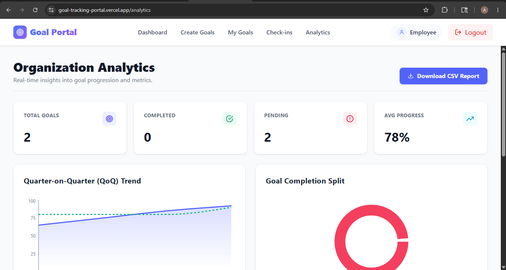

# 🎯 Goal Tracking Portal

A full-stack enterprise-style Goal Tracking and Performance Management System built using React.js, Node.js, Express.js, Prisma ORM, and PostgreSQL.

The platform allows employees to create goals, managers to review and approve goals, and administrators to monitor organizational activities through audit logs and analytics dashboards.

---

# 🌐 Live Demo

## Frontend
https://goal-tracking-portal.vercel.app

## Backend
https://goal-tracking-portal.onrender.com

---

# 🚀 Features

## 🔐 Authentication & Authorization
- JWT Authentication
- Secure Password Hashing using bcrypt
- Role-Based Access Control (RBAC)
- Employee, Manager, and Admin Roles
- Protected Frontend Routes

---

## 👨‍💼 Employee Features
- Create Multiple Goals
- Goal Weightage Validation
- Goal Progress Tracking
- Quarterly Check-ins
- KPI Achievement Monitoring
- Analytics Dashboard
- CSV Report Export

---

## 👨‍💻 Manager Features
- Approve Employee Goals
- Reject Goals with Comments
- View Pending Approvals
- Goal Locking Workflow

---

## 🛠️ Admin Features
- Audit Logs Monitoring
- Unlock Locked Goals
- Approval Change Tracking
- Administrative Controls

---

# 🧰 Tech Stack

## Frontend
- React.js
- React Router DOM
- Axios
- Tailwind CSS
- Recharts
- React Hot Toast
- Vite

---

## Backend
- Node.js
- Express.js
- Prisma ORM
- PostgreSQL
- JWT Authentication
- bcryptjs
- json2csv

---

# 🗄️ Database Models

## User Model
- Employee
- Manager
- Admin

## Goal Model
- Goal Information
- KPI Tracking
- Approval Workflow
- Locking Mechanism

## Checkin Model
- Quarterly Reviews
- Planned vs Actual Tracking
- Progress Score Calculation

## AuditLog Model
- Approval Logs
- Unlock History
- Change Tracking

---

# 🏗️ Project Architecture

```bash
goal-tracking-portal/
│
├── client/
│   ├── public/
│   │   └── screenshots/
│   │
│   ├── src/
│   │   ├── components/
│   │   ├── pages/
│   │   ├── hooks/
│   │   ├── context/
│   │   ├── layouts/
│   │   ├── services/
│   │   ├── App.jsx
│   │   ├── main.jsx
│   │   └── index.css
│
├── server/
│   ├── prisma/
│   │   ├── migrations/
│   │   └── schema.prisma
│   │
│   ├── src/
│   │   ├── config/
│   │   ├── controllers/
│   │   ├── middleware/
│   │   ├── routes/
│   │   ├── utils/
│   │   └── server.js

# 📡 API Endpoints

## 🔐 Authentication Routes

| Method | Endpoint             | Description   |
| ------ | -------------------- | ------------- |
| POST   | `/api/auth/register` | Register User |
| POST   | `/api/auth/login`    | Login User    |

---

## 🎯 Goal Routes

| Method | Endpoint                         | Description        |
| ------ | -------------------------------- | ------------------ |
| POST   | `/api/goals`                     | Create Goals       |
| GET    | `/api/goals/:employeeId`         | Get Employee Goals |
| GET    | `/api/goals/manager/pending/all` | Get Pending Goals  |
| PUT    | `/api/goals/approve/:id`         | Approve Goal       |
| PUT    | `/api/goals/reject/:id`          | Reject Goal        |
| GET    | `/api/goals/export/report`       | Export CSV Report  |

---

## 📈 Check-in Routes

| Method | Endpoint                | Description               |
| ------ | ----------------------- | ------------------------- |
| POST   | `/api/checkins`         | Create Quarterly Check-in |
| GET    | `/api/checkins/:goalId` | Get Goal Check-ins        |

---

## 🛡️ Admin Routes

| Method | Endpoint                | Description    |
| ------ | ----------------------- | -------------- |
| GET    | `/api/admin/logs`       | Get Audit Logs |
| PUT    | `/api/admin/unlock/:id` | Unlock Goal    |

---

# ⚙️ Installation Guide

## Clone Repository

```bash
git clone https://github.com/anushaanchalia/goal-tracking-portal.git
```

---

## Frontend Setup

```bash
cd client

npm install

npm run dev
```

---

## Backend Setup

```bash
cd server

npm install

npx prisma generate

npx prisma migrate dev

npm run dev
```

---

# 🔑 Environment Variables

## Client (.env)

```env
VITE_API_URL=https://goal-tracking-portal.onrender.com
```

---

## Server (.env)

```env
DATABASE_URL=your_database_url

JWT_SECRET=your_secret_key
```

---

# 🚀 Deployment

## Frontend Deployment

* Vercel

## Backend Deployment

* Render

## Database

* PostgreSQL

---

# 📊 Key Functionalities

## Goal Approval Workflow

1. Employee Creates Goal
2. Manager Reviews Goal
3. Manager Approves/Rejects
4. Approved Goals Become Locked
5. Admin Can Unlock Goals

---

## Quarterly KPI Tracking

* Planned Value
* Actual Achievement
* Progress Score Calculation
* KPI Monitoring

---

## Analytics Dashboard

* Goal Completion Pie Chart
* Progress Bar Chart
* CSV Report Generation

---

# 🔒 Security Features

* Password Hashing
* JWT Authentication
* Protected Routes
* Role-Based Authorization
* Secure API Communication

---

# 📸 Screenshots

## Login Page


---

## Employee Dashboard


---

## Manager Dashboard


---

## Analytics Dashboard



---

## Admin Dashboard


---

# 🔮 Future Enhancements

* Email Notifications
* Real-Time Chat
* AI-Based Goal Recommendations
* Advanced Analytics
* Team Performance Dashboard
* Mobile Application
* Notification System
* File Upload Support

---

# 👨‍💻 Author

## Anusha Anchalia

Full Stack Developer

---

# 📄 License

This project is developed for educational and learning purposes.
